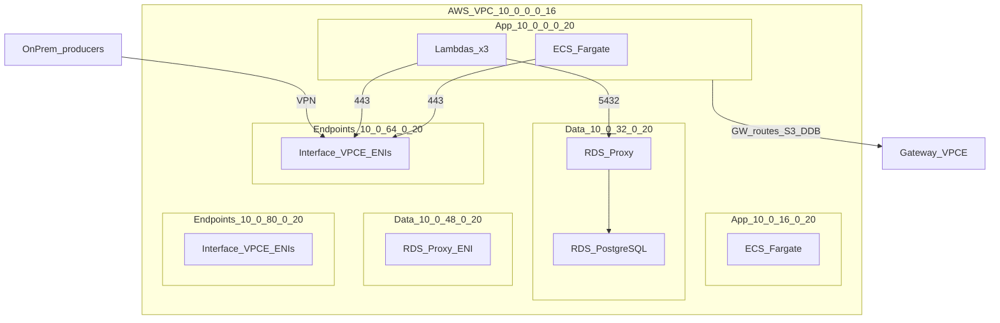

# Architecture — Asynchronous Fraud-Scoring Engine

This document describes the **target architecture** provisioned by this repository, the **trade-offs**, and the **explicit non-goals** of the current iteration. The Terraform composition is the single source of truth; this document only summarizes intent.

## 1. Context

The system scores incoming financial transactions for fraud asynchronously. Producers (out of scope of this repo) drop transactions on a queue; a horizontally-scaled pool of containers reads them, enriches each one with the user's recent behaviour from a key-value store, runs a scoring model, and writes the outcome.

Hard constraints driving the design:

- **AWS Academy** lab: short-lived account, no permission to create new IAM users/roles. Workloads must reuse `LabRole`.
- Reproducibility: every cloud change must live in code; no console clicks.
- Cost: the lab account is small. We avoid NAT gateways, customer-managed KMS keys, and multi-region setups.

## 3. Components

| Component                              | Module             | Type      | Notes                                                                                                          |
| -------------------------------------- | ------------------ | --------- | -------------------------------------------------------------------------------------------------------------- |
| VPC, three private subnet tiers, VGW, default SG | `modules/network`  | external + custom | Wraps `terraform-aws-modules/vpc/aws ~> 5.13`. **App** (`10.0.0.0/20`, `10.0.16.0/20`), **Data** (`10.0.32.0/20`, `10.0.48.0/20`), **Endpoints** (`10.0.64.0/20`, `10.0.80.0/20`). No NAT, no IGW. |
| Gateway VPC Endpoints (S3, DynamoDB)   | `modules/network`  | custom    | Attached to **app** route tables only.                                                                         |
| Interface VPC Endpoints (SQS, ECR-API, ECR-DKR, Logs, SNS, Secrets Manager, Cognito IDP) | `modules/network` | custom | ENIs in **endpoint** subnets. Shared SG (`<project>-endpoints-sg`) accepts HTTPS from app subnet CIDRs + on-prem CIDR via VPN. VGW propagation on endpoint route tables only. |
| SQS main queue + DLQ + redrive         | `modules/queue`      | custom    | `maxReceiveCount = 5`. SSE-SQS. Queue policy restricted to LabRole.                                            |
| DynamoDB `user_behavior` table         | `modules/data_store` | custom    | PK `user_id` (string), `PAY_PER_REQUEST`, SSE on, PITR on. Input to scoring.                                   |
| RDS PostgreSQL `fraud_results` DB      | `modules/data_store` | custom    | PostgreSQL 17.4, `db.t3.micro`, **data** subnets, encrypted. Output of scoring. Single-AZ lab configuration.    |
| RDS Proxy                              | `modules/data_store` | custom    | Connection pool between Lambdas and RDS in **data** subnets. `require_tls = true`, `iam_auth = DISABLED`, credentials via Secrets Manager. Prevents connection exhaustion on `db.t3.micro`.  |
| SNS summary topic + alert SQS + summarizer | `modules/notification` | custom | Summary-only alerting path: fraud events accumulate in SQS, EventBridge triggers a Lambda every `fraud_alert_summary_interval_minutes`, and SNS emails one summary to confirmed subscribers. |
| SQS results queue + DLQ                | `modules/results_writer` | custom | Direct buffer between the processor and writer Lambda. `maxReceiveCount = 3`, visibility timeout 180 s.                   |
| Lambda results-writer                  | `modules/results_writer` | custom | Python 3.12, in VPC, triggered by SQS. Connects to RDS via RDS Proxy with a psycopg2 layer.     |
| HTTP API Gateway + Lambda              | `modules/api`        | custom    | `GET /transactions`, `GET /stats`, `GET /health`. Lambda in VPC reaches RDS via RDS Proxy. Stays serverless instead of an always-running Fargate service. |
| ECR repo                               | `modules/compute`  | custom    | `MUTABLE` tags, scan-on-push.                                                                                   |
| ECS Cluster (Container Insights on)    | `modules/compute`  | custom    | Single cluster.                                                                                                 |
| Fargate task definition                | `modules/compute`  | custom    | LabRole as both task and execution role (lab constraint).                                                       |
| ECS service (2 tasks, app subnets) | `modules/compute`  | custom    | `assign_public_ip = false`, deployed in **app** subnets, `lifecycle { ignore_changes = [desired_count] }` so autoscaling owns capacity.       |
| Application Auto Scaling on queue depth | `modules/compute` | custom    | Target tracking with metric math (`messages / max(running, 1)`), step scaling fallback on raw `Visible` metric. |
| On-prem simulated VPC + CGW + Site-to-Site VPN | `modules/onprem_sim` | custom + embedded CFN | Public-only `192.168.0.0/16` VPC with one EC2 strongSwan router (deployed via `aws_cloudformation_stack` consuming `templates/vpn-gateway-strongswan.yml`). BGP-based `aws_vpn_connection` against the VGW. Gated by `var.enable_onprem_sim` (default `true`). |
| On-prem traffic producers (2× EC2) | `modules/onprem_sim` | custom | Two `aws_instance` resources (`producer-1`, `producer-2`) run a `systemd` service that continuously sends synthetic transactions to the ingestion SQS queue over VPN (~2,000 tx/min each by default). Gated by `var.enable_onprem_traffic_producers` (default `true`). |
| Private DNS for SQS from on-prem + queue lockdown | `modules/onprem_sim`, `modules/queue` | custom | Route 53 PHZ `sqs.<region>.amazonaws.com` associated only with the on-prem VPC (apex A record points at the SQS VPCE private IPs in **endpoint** subnets); static route `<aws-vpc-cidr> → strongSwan ENI` on the on-prem route table; SQS queue policy `Deny` on `sqs:SendMessage` unless `aws:VpcSourceIp` is inside the on-prem CIDR — only the on-prem site can publish. |

## 3.1 Subnet tiers (AWS VPC `10.0.0.0/16`)

| Tier | Route tables | Gateway VPCE | VGW propagation | Workloads |
| ---- | ------------ | ------------ | --------------- | --------- |
| App | Per-AZ app RT | S3, DynamoDB | No | ECS Fargate, Lambdas |
| Data | Per-AZ data RT (isolated) | None | No | RDS, RDS Proxy |
| Endpoints | Per-AZ endpoint RT | None | Yes (on-prem → SQS) | Interface VPCE ENIs |

PostgreSQL access from app tier to data tier is enforced by **security groups** (Lambdas/ECS → RDS Proxy → RDS on tcp/5432), not by subnet isolation alone.

## 4. Data and control flow

**Ingestion and scoring:**

1. Two dedicated on-prem EC2 producers (`producer-1`, `producer-2`) call `SendMessageBatch` on the SQS main queue using the SQS Interface VPC Endpoint over the VPN. Each runs a `systemd` unit that loops indefinitely (~200 messages every 6 seconds by default). The strongSwan router only terminates IPsec; `scripts/send_test_transactions.py` remains available for optional burst tests via SSM.
2. Fargate tasks consume from the queue, look up the user's behaviour features in DynamoDB via the DynamoDB Gateway Endpoint, run the scoring model, and send every result to the results SQS queue.
3. Failures on the ingestion queue are retried via SQS visibility timeout. After `maxReceiveCount = 5` deliveries, the message moves to the ingestion DLQ.
4. CloudWatch Logs receives container logs through the Logs Interface Endpoint.
5. ECR holds the container image, pulled through ECR API + DKR Endpoints.
6. Application Auto Scaling reads the queue depth and the running task count and adjusts `desired_count` so the queue stays close to the target backlog per task.

**Post-analysis and notification summaries:**

7. The results-writer Lambda is triggered by the SQS event source mapping and writes each fraud result to RDS PostgreSQL via RDS Proxy (`modules/data_store`).
8. If a scored transaction is fraudulent, the processor also sends it to the fraud-alert SQS queue (`modules/notification`).
9. The scheduled summarizer Lambda drains pending fraud alerts, publishes one compact SNS summary, and deletes messages only after `sns:Publish` succeeds.
10. The dashboard Lambda (`modules/api`) is invoked by API Gateway (`GET /transactions`) and queries RDS via RDS Proxy to serve fraud results to the dashboard client.
11. Dashboard invitations manage SNS email subscriptions: first successful activation requests a pending-confirmation subscription, and admin removal attempts unsubscribe after disabling access.

There is **no public ingress** to the AWS VPC. The VGW is attached and route propagation is enabled on **endpoint** route tables only (so on-prem can reach SQS VPCE ENIs). When `var.enable_onprem_sim = true` (default), `modules/onprem_sim` provisions a separate `192.168.0.0/16` VPC with one EC2 instance running strongSwan + Quagga BGP, plus the `aws_customer_gateway` and `aws_vpn_connection` that bring up two BGP-based IPsec tunnels against the VGW. The strongSwan EC2 itself is deployed by embedding `templates/vpn-gateway-strongswan.yml` inside an `aws_cloudformation_stack`, with PSKs delivered through AWS Secrets Manager.

From the on-prem side, the SQS hostname `sqs.<region>.amazonaws.com` resolves privately to the AWS VPC's SQS Interface VPC Endpoint via a Route 53 Private Hosted Zone associated only with the on-prem VPC. A static route `<aws-vpc-cidr> → strongSwan ENI` on the on-prem route table funnels that traffic into the VPN tunnel. SQS itself rejects `sqs:SendMessage` whose `aws:VpcSourceIp` is not inside the on-prem CIDR (using `NotIpAddressIfExists`, which also denies callers that lack a VPC source IP — i.e. the public internet). The net result is that **only producers in the on-prem VPC can publish**, while Fargate consumers in the AWS VPC remain free to `ReceiveMessage` and `DeleteMessage`.

## 5. Trade-offs and explicit non-goals

- **No NAT Gateway** — saves cost and forces all egress through VPC endpoints.
- **No customer-managed KMS keys** — AWS Academy disallows KMS CMK creation. AWS-owned/managed keys are used everywhere (S3 SSE-S3, DynamoDB SSE-AWS, SQS SSE-SQS, ECR AES256). Checkov findings for this are documented and skipped on the affected resources.
- **`LabRole` as both task and execution role** — AWS Academy disallows creating new roles. Documented `CKV_AWS_249` skip on `aws_ecs_task_definition`.
- **On-prem simulation is BGP-only and single-AZ.** `modules/onprem_sim` is intentionally minimal (one public subnet, permissive SG, one EC2 router plus two traffic producers). It can be disabled with `var.enable_onprem_sim = false` to skip both the VPN connection costs and the strongSwan stack rollout. Disable only the producers with `var.enable_onprem_traffic_producers = false`.
- **No VPC Flow Logs** — intentionally skipped for the lab footprint. Re-enable later when the Checkov `CKV2_AWS_11` finding becomes a hard requirement.
- **Container image ownership.** The processor image is built in the manual **Deploy** GitHub Actions workflow, tagged with the commit SHA, pushed to ECR, and passed back into Terraform as `image_uri`; it is owned by the Fargate service in `modules/compute`. The API Dockerfile is built for local validation only and is not pushed to ECR because the dashboard API runs as Lambda. The dashboard Dockerfile builds a static export instead of an ECR image; the Deploy workflow syncs that export to the S3 website bucket created by Terraform.
- **S3 backend with partial config.** `backend.tf` uses partial configuration; the bucket name (`itba-tp-fraud-tfstate-<account-id>`) is supplied at `terraform init` time via `-backend-config` in `make init`. DynamoDB locking is not used in the lab.

## 6. How the academic minima are met

| Requirement (from `docs/CONSIGNA.md`) | Where in this repo                                                                                              |
| ------------------------------------- | --------------------------------------------------------------------------------------------------------------- |
| ≥1 external module                    | `terraform-aws-modules/vpc/aws ~> 5.13` in `modules/network`.                                                    |
| ≥1 custom module                      | `modules/network`, `modules/queue`, `modules/data_store`, `modules/compute`, `modules/onprem_sim`, `modules/notification`, `modules/results_writer`, `modules/api`, `modules/dashboard` (9). |
| ≥4 Terraform functions                | `merge`, `format`, `cidrsubnet`, `toset`, `replace`, `length`, `can`, `cidrhost`, `jsonencode`, `contains`, `slice`. |
| ≥3 meta-arguments                     | `for_each` (gateway and interface endpoints), `lifecycle { ignore_changes }` (ECS service `desired_count`, CFN stack `pAmiId`), `depends_on` (service → SG egress rule, CFN stack → secret versions + VPN), `count` (`module.onprem_sim`), plus `validation` blocks on every variable. |
